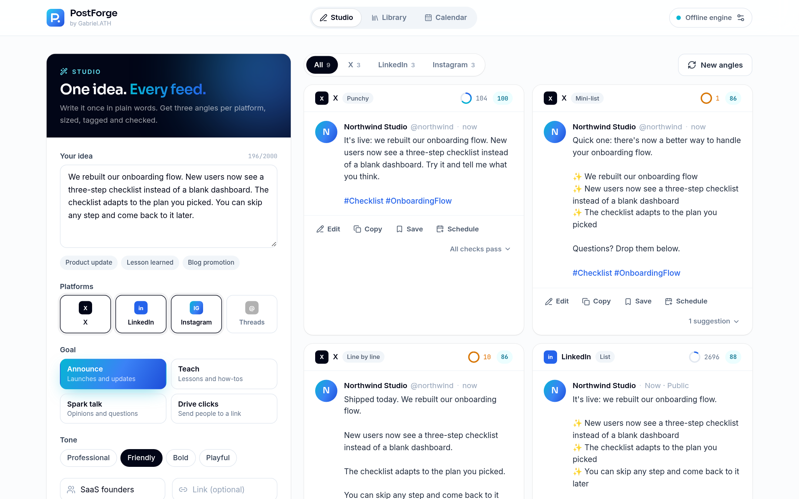
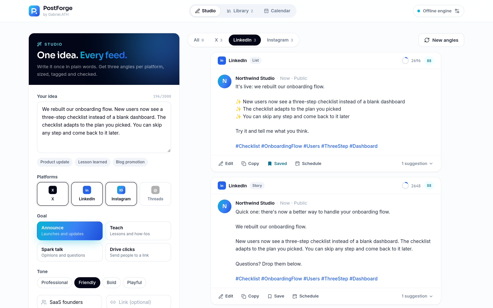
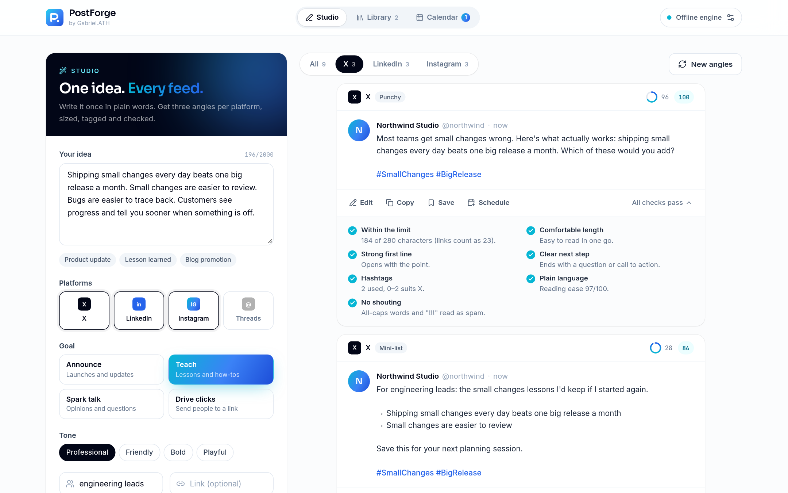
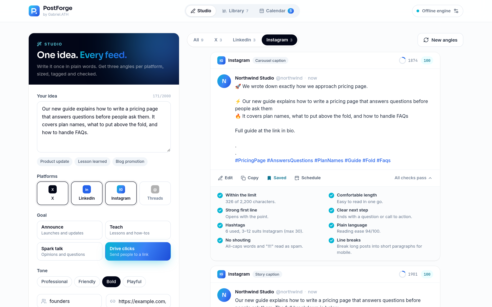
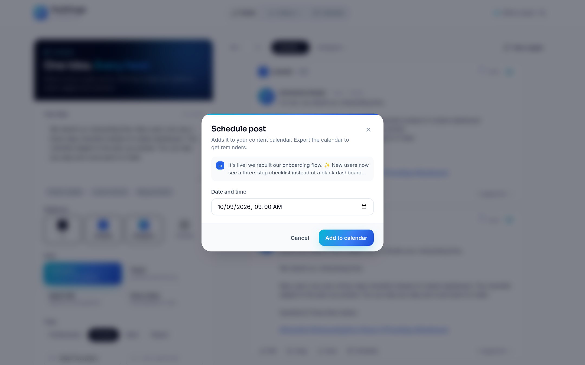
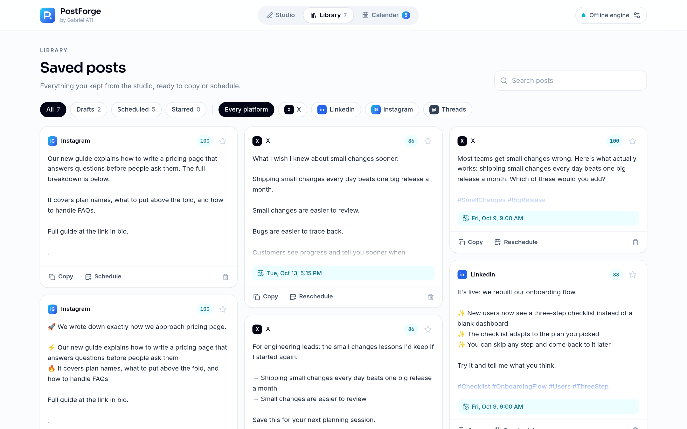
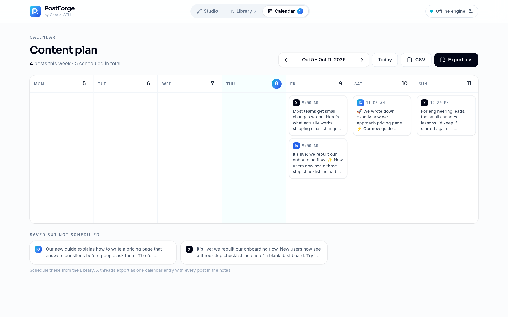
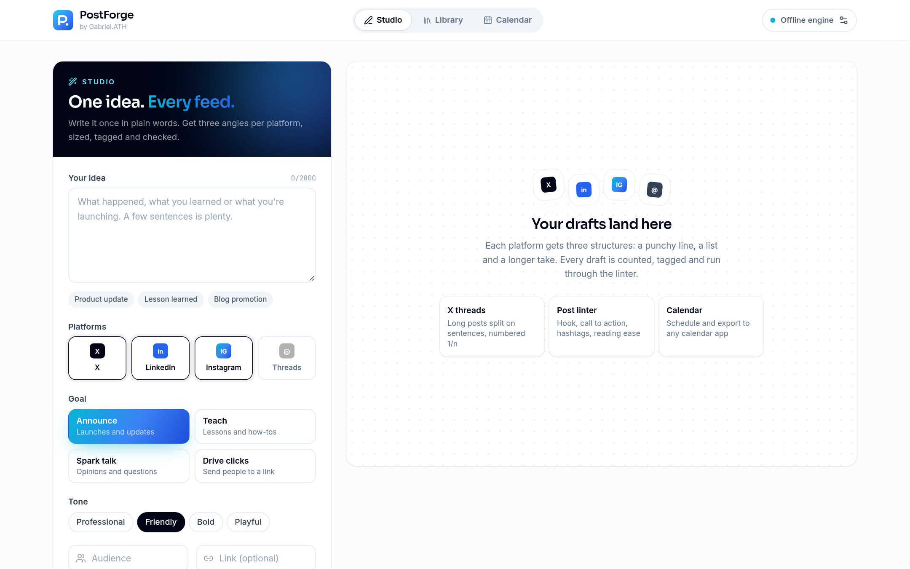
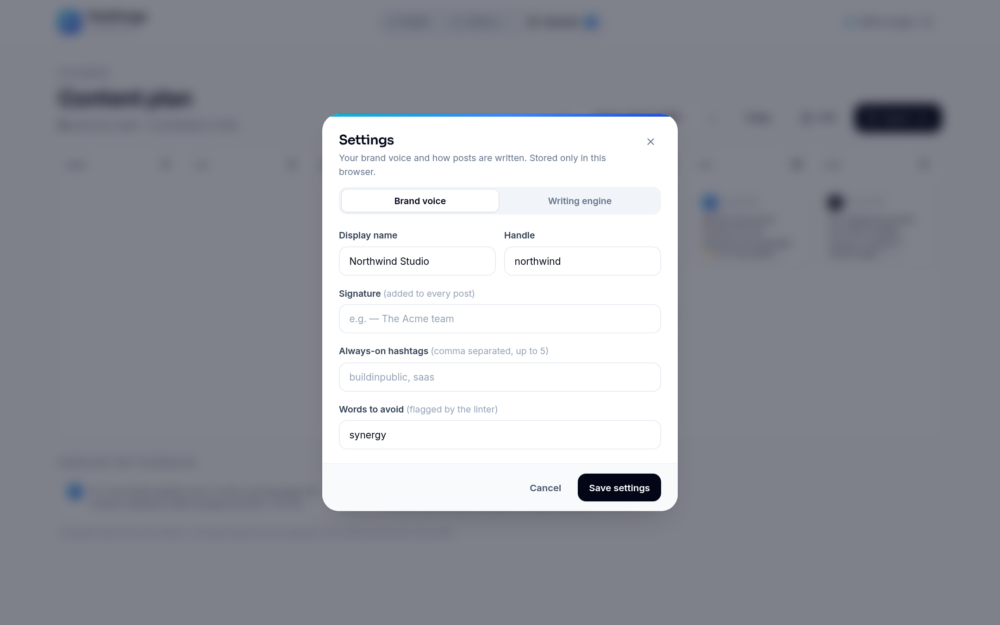

<div align="center">


# PostForge

### One idea. Every feed.

Write what happened in plain words. PostForge turns it into three ready-to-post angles for X, LinkedIn, Instagram and Threads, each sized to the platform, tagged, split into a thread when it runs long and checked by a post linter before you copy it.

No account, no server, no API key needed to try it.



</div>

---

## Why

Posting the same update everywhere usually means rewriting it four times: shorter for X, more structured for LinkedIn, a caption with a tag block for Instagram, something conversational for Threads. PostForge does that rewrite for you and tells you what is still weak about each draft, so you spend your time choosing and editing instead of starting from a blank box.

## What it does

**Studio**
- Describe your idea once, pick platforms, a goal (announce, teach, spark talk, drive clicks), a tone and an audience.
- Get **three structures per platform**: for X a punchy post, a mini list and a line-by-line take; for LinkedIn a list, a story and a takeaway; for Instagram a carousel caption, a story caption and a checklist; for Threads a conversational post, a two-liner and a question.
- **New angles** reshuffles hooks and calls to action without touching your idea.
- Every draft is shown in a platform-style preview with your display name and handle, and can be edited in place.

**Platform-accurate counting**
- X length is counted the way X counts it: links are always 23 characters and emoji count double.
- Long X drafts become a **numbered thread** (`1/4`, `2/4`…). The splitter keeps lists and paragraphs together and only wraps inside a sentence when it has to.
- Instagram links are flagged (they are not clickable in captions) and get a "link in bio" line instead. Threads allows one hashtag, Instagram up to 30.

**Hashtags that make sense**
- Suggested from the phrases in your idea, not single filler words: stopwords never start, end or sit inside a tag, and phrases near the start of your text rank higher.
- Brand hashtags from Settings are added to every post.

**Post linter**
- Checks each draft for: over the limit, comfortable length, a strong first line, a clear call to action, hashtag count for that platform, reading ease (Flesch score), all-caps or "!!!" shouting, links on Instagram, wall-of-text paragraphs and your own words to avoid.
- Each draft gets a score out of 100. A draft that breaks a hard rule (like the character limit) can never score above 40.

**Library and calendar**
- Save drafts to a library with search, status, platform filters and stars.
- Schedule posts into a week-view **content calendar** and export it as an `.ics` file for Google Calendar, Outlook or Apple Calendar, or as CSV. Threads export as one event with every post in the notes.

**Two writing engines**
- **Offline engine (default):** runs entirely in your browser, no network calls.
- **AI engine:** any OpenAI-compatible endpoint (OpenAI, OpenRouter, a local Ollama or LM Studio server). Your key is stored only in your browser. Replies are validated, and long X posts from the model are still split into threads and linted the same way.

## Screenshots

| LinkedIn previews | X thread and linter |
|---|---|
|  |  |

| Instagram caption with checks | Schedule a post |
|---|---|
|  |  |

| Library | Content calendar |
|---|---|
|  |  |

| Empty studio | Brand voice settings |
|---|---|
|  |  |

## Run locally

Requires Node.js 20.9 or newer.

```bash
git clone https://github.com/gabrielolarinre74-pixel/postforge-ai.git
cd postforge-ai
npm install
npm run dev
```

Open http://localhost:3000. Click one of the sample ideas (Product update, Lesson learned, Blog promotion) and press **Forge posts**.

To use the AI engine, press `,` or the engine button in the header, open **Writing engine** and add an OpenAI-compatible base URL, model and key. Nothing goes in `.env`; see [.env.example](.env.example).

```bash
npm test          # unit tests
npm run lint      # type-check
npm run build     # static export to ./out
npm start         # serve ./out
```

## How it is built

```
app/            Studio, Library and Calendar pages
components/     Previews, variant cards, linter list, dialogs
lib/
  compose.ts    offline engine: hooks, structures, CTAs per platform and goal
  thread.ts     list-aware thread splitter with i/n numbering
  count.ts      X-style length, graphemes, hashtags and links
  hashtags.ts   phrase-aware keyword ranking and tag suggestions
  lint.ts       post checks and the 0-100 score
  calendar.ts   week view helpers, .ics and CSV export
  ai.ts         prompt, endpoint validation and zod-checked replies
tests/          Vitest suites for all of the above
```

- Next.js 16 (App Router, static export), React 19, TypeScript
- Tailwind CSS 4 with a custom ocean-gradient and slate design system, Sora, Inter and JetBrains Mono
- Zod, lucide-react, react-hot-toast, clsx
- Vitest
- GitHub Actions: type-check, tests and build on every push

## License

MIT. See [LICENSE](LICENSE).

---

Designed and built by **Gabriel Zion · Gabriel.ATH**. I build websites, apps and AI automation that help businesses grow. [Portfolio](https://gabrielzion-portfolio.vercel.app)
